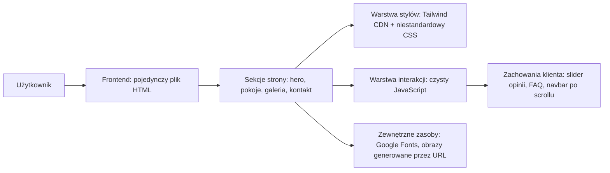
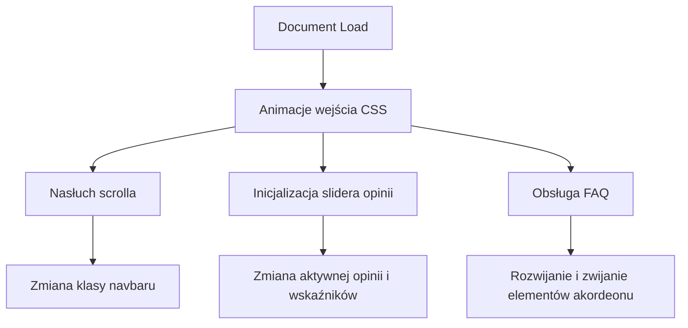

## 1. Projekt Architektury


## 2. Opis Technologii
- Frontend: `HTML5` + `Tailwind CSS (CDN)` + niestandardowy `CSS` + czysty `JavaScript`
- Model wdrożenia: statyczna, jednoplikowa strona typu landing / home page
- Inicjalizacja: brak wymogu frameworka, ponieważ użytkownik jawnie oczekuje kompletnego kodu w jednym pliku
- Zależności zewnętrzne: `Google Fonts` dla `Cormorant Garamond` i `Manrope`

## 3. Definicje Tras
| Trasa | Cel |
|-------|-----|
| / | Strona główna `NOSALOVE Apartamenty` z pełnym doświadczeniem marki i formularzem kontaktowym |

## 4. Definicje API
Brak backendu i brak zewnętrznego API wymaganego do podstawowego działania makiety. Formularz rezerwacyjny działa jako warstwa prezentacyjna z gotowym układem pól i przyciskiem CTA.

```ts
type Review = {
  author: string
  rating: "5/5"
  content: string
}

type RoomCard = {
  name: string
  size: string
  capacity: string
  priceFrom: string
  features: string[]
}
```

## 5. Diagram Warstwy Klienckiej


## 6. Model Danych
### 6.1 Definicja Danych Widoku
Treści są osadzone bezpośrednio w pliku HTML jako statyczne dane strony:
- dane marki: nazwa, adres, telefon, status 3-gwiazdkowy, ocena Google, cena od 300 zł
- listy sekcyjne: atuty, pokoje, odległości, promocje, FAQ
- opinie: trzy przekazane cytaty z Google

### 6.2 Zasady Implementacyjne
- Strona pozostaje w jednym pliku `index.html`.
- Wszystkie sekcje są semantyczne i kotwiczone do nawigacji.
- Główna jakość wizualna powstaje przez połączenie Tailwinda z własną warstwą CSS: tekstury, mesh gradients, glassmorphism, opóźnione animacje i miękkie cienie.
- Interakcje są lekkie i nie wymagają bibliotek JS: slider opinii, animowany FAQ, stan navbaru po scrollu.
- Obrazy powinny korzystać z adresów `https://coresg-normal.trae.ai/api/ide/v1/text_to_image?...` zgodnie z wymogami środowiska.
