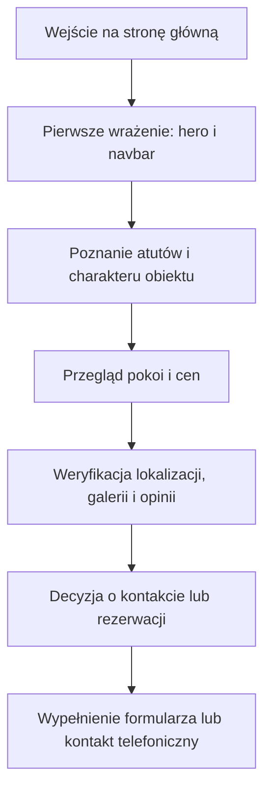

## 1. Przegląd Produktu
Jednostronicowa witryna premium dla `NOSALOVE Apartamenty`, zaprojektowana jako doświadczenie digital-first budujące zaufanie, atmosferę ciszy i poczucie wysokiej jakości już w pierwszych sekundach.
- Główny cel: zwiększenie liczby zapytań i rezerwacji poprzez wyrafinowaną prezentację obiektu, jego lokalizacji, udogodnień, oferty pokoi i opinii gości.
- Wartość biznesowa: odróżnienie marki od lokalnych, szablonowych stron noclegowych dzięki estetyce klasy premium i czytelnemu prowadzeniu użytkownika do kontaktu.

## 2. Kluczowe Funkcje

### 2.1 Moduły Funkcjonalne
1. **Strona główna**: hero, pływająca nawigacja, sekcje informacyjne, oferta pokoi, promocje, galeria, opinie, formularz kontaktowy, FAQ, stopka.

### 2.2 Szczegóły Strony
| Nazwa strony | Nazwa modułu | Opis funkcji |
|--------------|--------------|--------------|
| Strona główna | Pływający navbar | Szklany, kapsułkowy pasek z logo, sekcjami menu i CTA `Zarezerwuj`, który kurczy się po scrollu i zwiększa blur. |
| Strona główna | Hero | Pełnoekranowe intro z obrazem Tatr, dużym nagłówkiem szeryfowym, krótkim podtytułem, dwoma CTA i animacją wejścia staggered reveal. |
| Strona główna | Atuty | Siatka kart z konkretnymi przewagami obiektu: widok, lokalizacja, basen, śniadanie, parking, pet-friendly. |
| Strona główna | O obiekcie | Asymetryczny układ z dwoma krótkimi akapitami i nakładającymi się zdjęciami budującymi głębię. |
| Strona główna | Pokoje / Apartamenty | Trzy równe karty z fotografią, parametrami, wyposażeniem i ceną od 300 PLN / noc oraz CTA. |
| Strona główna | Lokalizacja | Blok z mapą stylizowaną kolorystycznie lub siatką odległości, zawierający adres i czasy dojścia do kluczowych punktów. |
| Strona główna | Promocje i pakiety | Szerokie karty ofertowe na odrębnym tle kolorystycznym, podkreślające oferty sezonowe i pobytowe. |
| Strona główna | Galeria | Asymetryczny masonry grid z efektem lekkiego powiększenia zdjęć na hover. |
| Strona główna | Opinie | Elegancki slider CSS/JS wykorzystujący 3 dostarczone opinie Google i eksponujący ocenę `4.9/5 (148 opinii)`. |
| Strona główna | Kontakt / Rezerwacja | Dwukolumnowy blok z danymi obiektu po lewej i minimalistycznym formularzem z floating labels po prawej. |
| Strona główna | FAQ | Akordeon z animacją wysokości dla najczęstszych pytań o meldunek, dojazd i zwierzęta. |
| Strona główna | Footer | Wielokolumnowa stopka z atutami, adresem, skrótami i social mediami. |

## 3. Główny Przepływ Użytkownika
Użytkownik trafia na stronę, od razu odbiera charakter marki przez hero i estetykę, następnie przegląda najważniejsze atuty, zapoznaje się z pokojami, lokalizacją i opiniami, po czym przechodzi do sekcji rezerwacyjnej lub kontaktowej i wykonuje akcję.

## 4. Projekt Interfejsu
### 4.1 Styl Wizualny
- Kolory główne: perłowa biel `#F9F9F8`, węglowy grafit `#1A1A1A`, akcent magenta `#E5006D`, wspierające róże i beże o bardzo niskim nasyceniu.
- Styl przycisków: zaokrąglone kapsuły, cienkie obrysy, miękkie cienie, stonowane hover states z unoszeniem i pogłębieniem kontrastu.
- Typografia: `Cormorant Garamond` dla nagłówków i `Manrope` dla treści, menu, danych i formularza.
- Układ: desktop-first, duże połacie światła, asymetria, nakładanie się bloków, miękkie kontenery z bardzo subtelną teksturą i ornamentem.
- Ikony: delikatna kreska, minimalistyczne piktogramy, bez ludowego folkloru i bez ciężkich dekoracji.

### 4.2 Przegląd Projektu Strony
| Nazwa strony | Nazwa modułu | Elementy UI |
|--------------|--------------|-------------|
| Strona główna | Hero | Ciemne overlay na zdjęciu, duży szeryfowy headline, odsunięte liternictwo, subtelne badge z oceną i statusem 3-gwiazdkowym, dwa CTA. |
| Strona główna | Atuty | Karty z półtransparentnym tłem, zaokrąglonymi rogami i małymi ikonami liniowymi. |
| Strona główna | O obiekcie | Kompozycja dwóch zdjęć z dużym obrazem dominującym i mniejszym zdjęciem zachodzącym z boku. |
| Strona główna | Pokoje | Duże karty o jednakowej wysokości, fotografie z miękkim promieniem, lista wyposażenia i przycisk w akcencie marki. |
| Strona główna | Lokalizacja | Odcinek z mapą lub artystycznym blokiem danych, badge z adresem i listą odległości. |
| Strona główna | Promocje | Karty panoramiczne z warstwami tła, delikatnymi gradientami i dużym spacingiem. |
| Strona główna | Galeria | Masonry grid z kontrolowanymi proporcjami, overflow-hidden i efektem scale na hover. |
| Strona główna | Opinie | Slider z pojedynczą aktywną opinią, punktami nawigacyjnymi i subtelnym ruchem przejścia. |
| Strona główna | Kontakt | Formularz z cienkimi liniami, floating labels, kalendarzowymi ikonami i blokiem danych w lekkich ramkach. |
| Strona główna | FAQ i footer | Cienkie rozdzielenia, czytelna typografia i kontrastowy ciemny footer z wyraźną strukturą kolumn. |

### 4.3 Responsywność
- Podejście desktop-first z dopracowaną adaptacją do tabletów i telefonów.
- Na mniejszych ekranach navbar przechodzi do uproszczonego układu, a sekcje asymetryczne składają się do jednej kolumny bez utraty oddechu wizualnego.
- Galeria, karty pokoi i promocje zachowują rytm pionowy oraz czytelne odstępy dotykowe.
